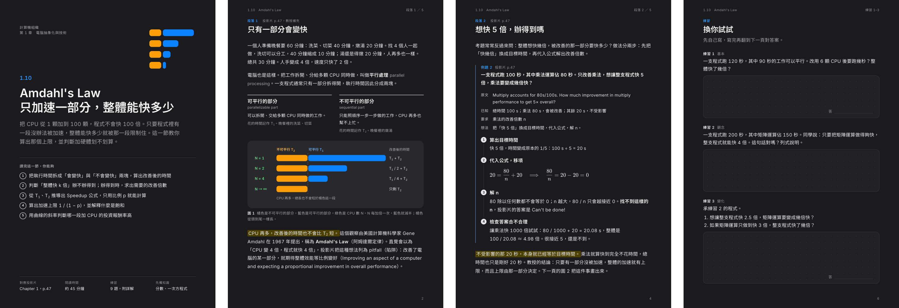
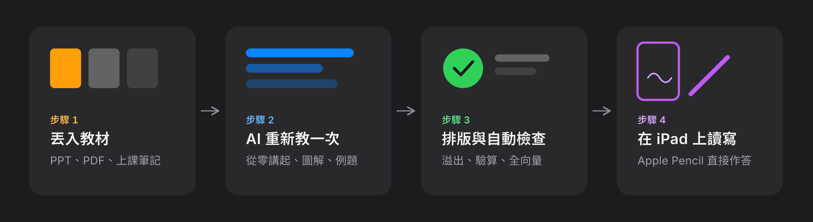
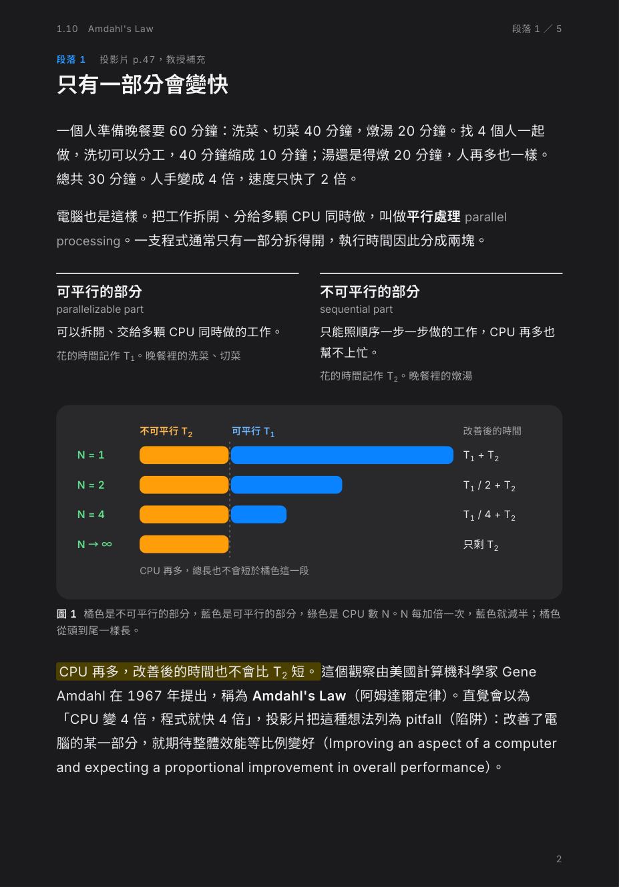
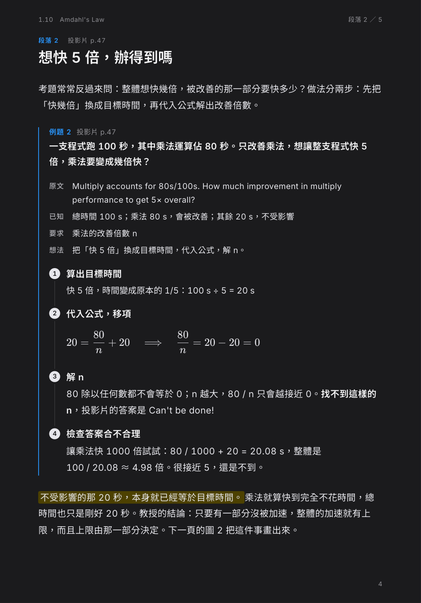
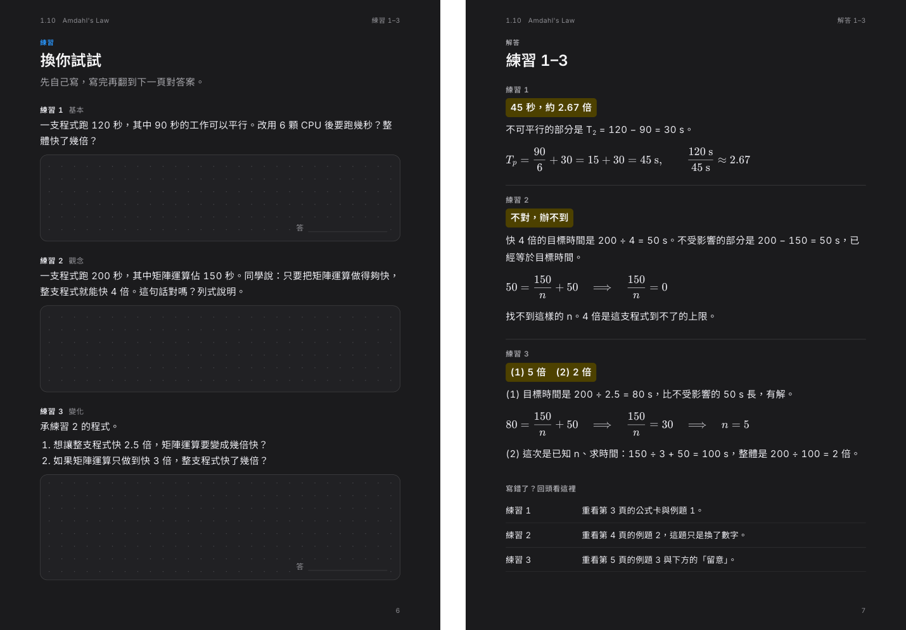
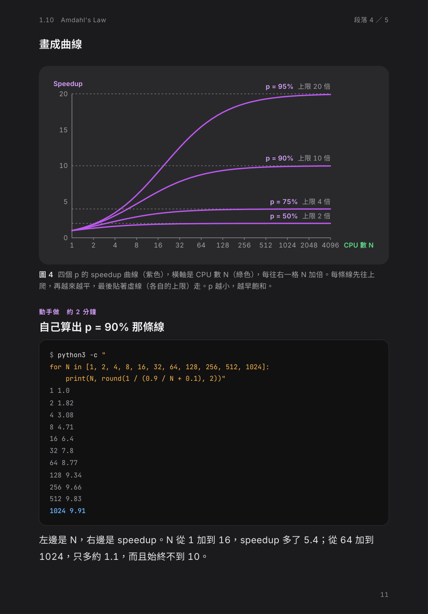
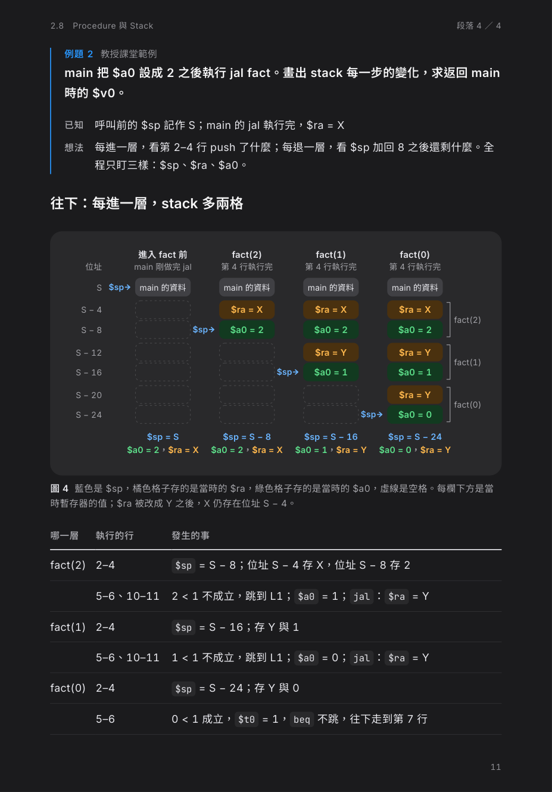
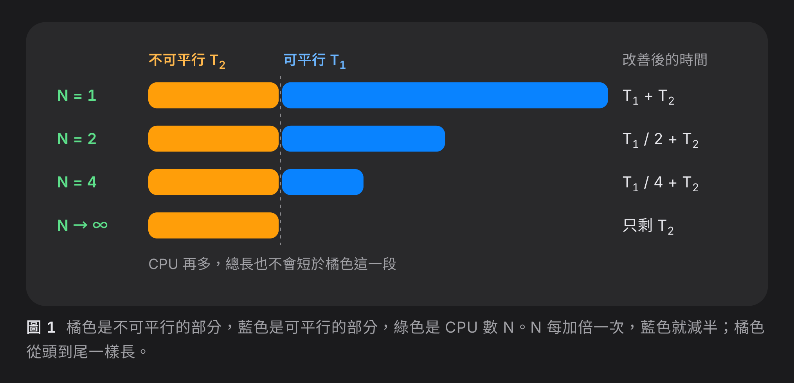
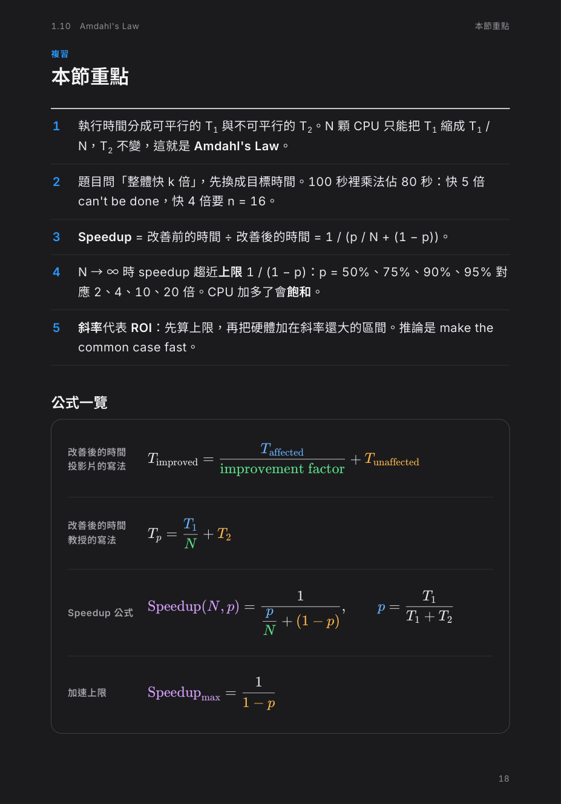

<p align="center">
  
</p>

# iPad 深色講義

把上課的投影片、PDF 或筆記交給 AI，產出一份在 iPad 上好讀、可以直接用 Apple Pencil 作答的深色 PDF 講義。

> **English** — An Agent Skill that turns lecture slides into dark-mode, pen-ready study handouts for the 11-inch iPad. It re-teaches each topic from scratch with diagrams, worked examples and practice pages, then builds a fully vector PDF. Output language: Traditional Chinese (Taiwan).

---

## 概覽

老師的投影片是寫給「已經聽過課的人」看的：重點很密、步驟常常省略、公式和圖只存在圖片裡。這個 skill 讓 AI 先讀懂教材，再**依照初學者需要的順序重新教一次**，最後排成固定格式的講義。

<p align="center">
  
</p>

每一份講義都有這些特點：

- **從零講起**：每個概念依「生活情境 → 白話定義 → 圖解 → 公式 → 例題」的順序展開，術語附英文對照，方便對照課本與考卷。
- **為 iPad 設計**：頁面尺寸就是 11 吋 iPad 直向的螢幕大小，不用縮放；深色底色適合長時間閱讀。
- **可以直接作答**：練習題附點陣書寫區，解答固定在下一頁，寫完翻頁就能對答案。
- **品質有把關**：建置時自動檢查每頁有沒有內容超出版面；例題與解答的數字會用程式重算一次。
- **全向量 PDF**：文字、公式、圖解都是向量，放到最大也不會糊。

---

## 支援平台

這個 skill 使用 [Agent Skills](https://agentskills.io) 開放格式，理論上支援所有能讀取 `SKILL.md` 的 AI 工具。製作過程需要執行 Node.js 與無頭瀏覽器，所以平台必須能執行程式碼。

| 平台 | 狀態 | 說明 |
|---|---|---|
| Claude Cowork | ✅ 已實測 | 範例截圖都是用 Cowork 製作的 |
| Claude.ai | 🧪 待測試 | 需要開啟程式碼執行功能 |
| Claude Code | 🧪 待測試 | 在你的電腦上執行，需要先安裝相依工具 |
| Codex | 🧪 待測試 | 在你的電腦上執行，需要先安裝相依工具 |
| ChatGPT | 🧪 待測試 | 沙箱可能無法安裝 npm 套件，可能無法完成 PDF 建置 |

> [!NOTE]
> 如果你在「待測試」的平台上成功或失敗，歡迎開 [Issue](../../issues) 告訴我，我會更新這張表。

---

## 安裝 skill

依你使用的平台選擇一種方式。

### Claude Cowork 與 Claude.ai

1. 到 [Releases](../../releases) 頁面下載最新的 `ipad-study-handout.zip`。
2. 開啟 Claude 的**設定**，在 **Capabilities** 裡確認**程式碼執行**（Code execution）已開啟。
3. 在 **Skills** 區塊選擇 **Upload skill**，上傳剛剛下載的 zip 檔。
4. 確認清單中出現 `ipad-study-handout`，並且是開啟狀態。

> [!NOTE]
> 需要 Pro、Max、Team 或 Enterprise 方案。設定頁面的名稱可能隨 Claude 更新而調整。

如果 Releases 還沒有檔案，也可以自己打包：

```bash
git clone https://github.com/xamjiang/ipad-study-handout.git
cd ipad-study-handout/skills
zip -r ../ipad-study-handout.zip ipad-study-handout
```

### Claude Code

把 skill 資料夾複製到個人的 skills 目錄：

```bash
git clone https://github.com/xamjiang/ipad-study-handout.git
cp -R ipad-study-handout/skills/ipad-study-handout ~/.claude/skills/
```

### Codex

複製到 Codex 的 skills 目錄：

```bash
git clone https://github.com/xamjiang/ipad-study-handout.git
cp -R ipad-study-handout/skills/ipad-study-handout ~/.codex/skills/
```

只想在某個專案裡使用的話，改為複製到該專案的 `.agents/skills/`。

### 在自己的電腦上執行時：安裝相依工具

Claude Code 與 Codex 會在你的電腦上建置 PDF，所以要先安裝下列工具。Cowork 與 Claude.ai 在雲端沙箱執行，可以跳過這一步。

| 工具 | 用途 | 必要性 |
|---|---|---|
| [Node.js](https://nodejs.org) 18 以上 | 執行建置腳本 | 必要 |
| Playwright 與 Chromium | 把 HTML 轉成 PDF | 必要 |
| poppler | 讀取 PDF 文字、轉縮圖、檢查字型 | 必要 |
| LibreOffice | 把 PPT 轉成 PDF | 教材是 PPT 時才需要 |

macOS 可以用 [Homebrew](https://brew.sh) 安裝：

```bash
brew install node poppler
brew install --cask libreoffice          # 教材是 PPT 時才需要
npx playwright install chromium          # 下載 Playwright 使用的瀏覽器
```

> [!TIP]
> 不想安裝 LibreOffice 的話，可以先在 PowerPoint 或 Keynote 裡把投影片匯出成 PDF，再交給 AI。

---

## 製作第一份講義

### 步驟 1：準備教材

把投影片、PDF 或筆記準備好。一份講義只教**一個小節**，大約對應 6–12 張投影片，成品約 12–20 頁。

> [!TIP]
> 教材很長的話，直接指定頁碼範圍，例如「第 47–60 頁」。章節太長時，AI 也會自動拆成「上」「下」兩份，並告訴你這份涵蓋到哪裡。

### 步驟 2：交給 AI

上傳教材，然後用一句話說出你要什麼。不需要特別提到 skill 的名稱，AI 會自己判斷要不要使用。

```text
幫我把這份投影片的 1.10 節做成講義
```

```text
把第 2 章 p.37–46 整理成好讀版，我下週要小考
```

```text
這是計算機組織第 1 章，幫我整理 Amdahl 定律那一段
```

### 步驟 3：等待製作完成

AI 會依序完成這些事，過程中不需要你介入：

1. 把每一頁教材轉成文字與縮圖，並實際看過每一頁（公式和圖常常只存在圖片裡）。
2. 決定範圍，把內容切成 3–6 個段落，每段只講一個概念。
3. 撰寫內容、繪製圖解、排版。
4. 建置 PDF，並修正所有超出版面的頁面。
5. 逐頁檢查成品，並用程式驗算每一題的數字。

### 步驟 4：閱讀 AI 的回覆

完成後，AI 會附上 PDF，並用一兩句話說明：

- 這份講義**涵蓋投影片的哪些頁**。
- 有沒有**不確定或自行補充**的地方，例如投影片疑似有錯、或為了說清楚而加入的例子。

> [!IMPORTANT]
> 請留意 AI 標出的不確定之處，有疑問時以課本和老師的說法為準。

### 步驟 5：傳到 iPad

用 AirDrop 或 iCloud 雲碟把 PDF 傳到 iPad，再用 GoodNotes、Notability 或內建的「檔案」App 開啟，就可以直接在書寫區作答。

---

## 了解講義的結構

每份講義都由幾種固定的頁面組成，順序也固定，讀過一份之後，之後的每一份都知道去哪裡找什麼。

### 節首頁與概念頁

<table>
  <tr>
    <td width="50%"></td>
    <td width="50%"></td>
  </tr>
  <tr>
    <td><b>節首頁</b>：一句話說出這節在問什麼，列出讀完之後能做到的事，以及對應的投影片頁碼、閱讀時間與先備知識。</td>
    <td><b>概念頁</b>：從生活情境開始，帶出術語與中英對照，再用圖解和公式說明。整頁最關鍵的一句話會用螢光標出。</td>
  </tr>
</table>

### 例題頁

<table>
  <tr>
    <td width="50%"></td>
    <td width="50%">
      <p>每一題都先列出<b>已知、要求、想法</b>，再用編號步驟一步一步解，每一步都有一句小標說明在做什麼。</p>
      <p>最後一步固定是<b>檢查答案合不合理</b>，養成驗算的習慣。</p>
      <p>投影片上原有的例題會優先採用，並標明出處頁碼。</p>
    </td>
  </tr>
</table>

### 練習頁與解答頁

<p align="center">
  
</p>

練習題分成**基本、觀念、變化、綜合**四種層次，每頁最多三題，每題都有點陣書寫區。**解答一定在練習的下一頁**：先給出最終答案，再給完整步驟，頁尾的「寫錯了？回頭看這裡」會告訴你該回去看哪一頁。

### 圖解

<table>
  <tr>
    <td width="50%"></td>
    <td width="50%"></td>
  </tr>
  <tr>
    <td>函數曲線與「動手做」：附上可以自己執行的程式碼，親眼看到概念的結果。</td>
    <td>結構與流程圖：把每一步的變化並排畫出來，比文字說明更容易追蹤。</td>
  </tr>
</table>

所有圖解都使用同一套色盤，**同一個顏色在整份講義裡只代表一件事**，而且和公式裡的色塊對應。圖解是向量繪製，放大後依然清晰：

<p align="center">
  
</p>

### 複習頁

<table>
  <tr>
    <td width="50%"></td>
    <td width="50%">
      <p>每份講義的最後依序是：</p>
      <ol>
        <li><b>本節重點</b>：每個段落濃縮成一句話</li>
        <li><b>公式一覽</b>：考前快速複習用</li>
        <li><b>自我檢查</b>：可以勾選的能力清單</li>
        <li><b>術語對照</b>：中文、英文與一句話解釋</li>
        <li><b>下一節預告</b></li>
      </ol>
    </td>
  </tr>
</table>

---

## 自訂講義

### 在對話中調整

最簡單的方式是直接在對話中告訴 AI，例如：

```text
練習題多一點，每個段落後面都放一頁
```

```text
這份不需要「動手做」的段落
```

```text
我已經學過微積分，基礎的部分可以講快一點
```

### 修改 skill 的預設值

想讓每一份講義都套用你的偏好，可以直接修改 skill 的檔案：

| 想改的東西 | 修改的位置 |
|---|---|
| 讀者程度、語言、偏好 | `SKILL.md` 開頭的「讀者設定」 |
| 教學順序、練習數量 | `SKILL.md` 的〈教學規則〉 |
| 顏色、字級、間距 | `assets/handout.css` 開頭的 CSS 變數 |
| iPad 尺寸 | `assets/handout.css` 的 `--page-w`、`--page-h`、`@page`，以及 `scripts/build.mjs` 的 viewport |

> [!NOTE]
> 修改後，Cowork 與 Claude.ai 需要重新打包成 zip 並再上傳一次。

---

## 疑難排解

<details>
<summary><b>出現「找不到 playwright」</b></summary>

在講義的工作資料夾裡安裝 Playwright 與它使用的瀏覽器：

```bash
npm i playwright
npx playwright install chromium
```

</details>

<details>
<summary><b>PPT 檔讀不進去</b></summary>

轉換 PPT 需要 LibreOffice。可以安裝 LibreOffice，或先在 PowerPoint、Keynote 裡把投影片匯出成 PDF 再上傳。

</details>

<details>
<summary><b>PDF 有內容被截掉</b></summary>

建置腳本會回報每一頁的剩餘空間，AI 應該在交付前修正所有溢出。如果成品仍有被截掉的地方，請告訴 AI 是第幾頁，請它重新分頁。

</details>

<details>
<summary><b>PDF 裡的字變成方框或模糊</b></summary>

字型必須使用 `@fontsource` 的靜態字重版本。請確認工作資料夾是用 skill 附的 `package.json` 安裝套件，不要改用 variable 版本的字型。

</details>

---

## 使用須知

- **AI 可能出錯**：skill 會要求 AI 驗算所有數字並標出不確定的地方，但請仍以課本與老師的說法為準。
- **尊重著作權**：上課教材的著作權屬於老師或出版社。用這個 skill 製作的講義請只供個人學習使用，不要公開散布。

---

## 專案結構

```text
.
├── README.md
├── LICENSE
├── docs/images/                  README 使用的圖片
└── skills/ipad-study-handout/    skill 本體
    ├── SKILL.md                  流程與規則
    ├── assets/
    │   ├── handout.css           樣式與色盤
    │   ├── template.html         每種頁面的範本
    │   └── package.json          字型與 KaTeX 的版本
    └── scripts/
        └── build.mjs             建置、溢出檢查、輸出 PDF
```

## 參與貢獻

歡迎開 Issue 回報問題或分享你的使用結果。送出 Pull Request 時，commit 訊息請遵守 [Conventional Commits](https://www.conventionalcommits.org/zh-hant/v1.0.0/)，例如：

```text
feat(skill): 新增 13 吋 iPad 的版面
fix(build): 修正 KaTeX 巨集的顏色
docs: 補充 Codex 的安裝步驟
```

## 授權

本專案以 [MIT License](LICENSE) 授權。README 中的範例截圖取自作者自己的課程講義，僅供展示。
